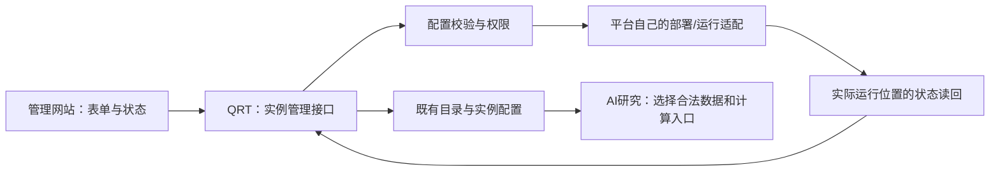

# 运行实例管理与平台解耦方案

2026-09-08，按用户关于“在 Settings 仓库和管理网站加减运行平台”的讨论整理。此文记录管理模块的分阶段边界。2026-09-09 已实现实例草稿的存储、管理接口和页面；本轮没有部署、创建线上资源、启用账户或执行停机。

## 目标与对象

允许用户在管理网站增加、配置、停用、移除**已支持平台的运行实例**。同一个 IBKR、LongBridge 等平台可以有多个实例，各实例绑定明确账户、部署与策略。新增券商种类先交付适配器和验证，再进入可选目录。

| 对象 | 例子 | 允许的管理动作与健康含义 |
| --- | --- | --- |
| 交易运行实例 | 某个 IBKR 账户上的策略服务 | 新增配置、校验、启用、停用、退役；检查会话、应到业务周期、订单和对账 |
| 数据源连接 | Alpaca Market Data、批准的 A 股行情来源 | 绑定/解绑、检查访问权限及产物时效；不提供交易启停按钮 |
| 连接服务 | 某个 IBKR Gateway | 关联实例、查看会话和依赖；移除前检查共享依赖，重启仍是单独运维操作 |

同一来源可以服务多个研究任务；一个 Gateway 也可能关联多个服务目标。增加或减少一个实例，不要求新增或删除仓库。

多个实例不等于允许多个服务同时接管同一账户。新增与重新绑定时仍须满足现有账户唯一执行者、订单限制和对账要求；不能通过换实例名称绕过冲突检查。

## 复用当前实现

- `platform-config.json`、生成的 `config.js` 和 `platform_registry.js` 已是支持平台及能力的目录；保留它们，不再建立第二套插件注册中心。
- `/admin` 与 `/api/admin/config` 已有管理员认证、同源写保护、account options、审计和 KV 存储。目前账户配置与访问权限在同一提交中，页面还主要依赖 JSON 编辑。
- `account_options_schema.js` 已描述实例键、名称、目标、账户/部署选择器、服务名和默认策略/执行模式；优先沿用字段和身份，不重造运行目标 ID。
- 已有 runtime lifecycle、execution evidence、decision-data 和风险配置应作为读回来源；配置记录不能代替这些观察结果。

## 模块职责

QRT 负责配置、依赖关联和操作编排；各平台负责实际 API/云资源差异，策略仓只负责策略计算。QRT 不导入券商 SDK，不持仓、不对账、不保存凭据明文。现有 Secret Manager / 受保护环境继续负责凭据；页面仅保存已批准存储的引用并显示“可用/不可用”，不提供绕过账户认证的入口。

## 最小分阶段实现

### 1. 先分离实例配置编辑

在现有 Worker 内提供窄实例接口，例如 `/api/admin/runtime-instances`；命名以实现时接口清单为准。复用现有管理员/同源认证与 account options 校验；实例配置、版本和审计由单个 SQLite Durable Object 原子保存，KV 继续保存登录权限和观察资料，不允许该接口修改管理员或登录权限。旧 `/api/admin/config` 保持兼容，迁移后也必须经过同一实例规则，不能留下旧入口绕过新保护。

页面从 JSON 编辑改为表单：选择已支持的平台，填写实例名称、已有部署/账户引用、合法策略、数据/连接依赖。服务名、账户身份或 execution mode 的变化按已有身份变更处理，不能作为普通改名绕过审批。

新增默认处于未应用、未启用状态。返回配置保存结果和实际运行观察两个独立字段；没有部署读回就显示“待应用/未知”。有版本冲突时拒绝过期编辑，不能只靠浏览器上一次读到的列表覆盖他人改动。KV 不提供事务 CAS；需要并发写时，先复用已有串行工作流或使用具备真实事务能力的存储，不能用读后写模拟原子性。

### 2. 再接平台应用与退役

新增：选择适配器 → 保存实例配置 → 校验部署/凭据引用与依赖 → 审阅实际变更 → 明确启用 → 读回。已有资源绑定与新建资源分开；新资源涉及费用或权限时展示具体变更及其授权要求。

停用：调用既有精确目标 stop-only。只有实际触发源与运行开关读回一致才能标记停用；配置保存不算完成。停新触发不代表在途请求已结束。

移除：先确认已停止新触发，再核对在途任务、未决订单和账户接管/持仓关联。条件满足才从可操作实例列表退役；保留旧实例 ID、审计、历史证据及关联，防止复用旧 ID 误接历史订单。默认不删除云资源、凭据、历史资料或自动平仓。共享数据源/Gateway 尚有引用时不能直接移除。

活跃资金目标不能通过删配置让系统“看不见”。证据不足则显示具体未完成条件；已经停用的实例也不能因重新加入目录自动恢复。

### 3. 数据源和 Gateway 沿同一管理页分类呈现

通过既有数据源 ID 和运行引用关联；不同类别共用身份、表单和查看体验，各自调用适用的校验器和操作。Alpaca 当前归入数据来源；额外 `alpaca` 观察标识仍兼容历史 shadow 材料，不能生成实盘实例。QMT 策略示例先关联研究数据与计算入口，有真实 miniQMT 运行环境后才能建立券商实例。

AI 可以建议依赖、配置检查与研究任务；接口的能力和授权由确定性代码判断，不由模型填写 `live=true` 获得权限。

## 验收与改动范围

首片修改 `worker.js` 的管理路由、事务对象与页面，新增实际 workerd 测试、开发依赖锁、CI 检查及 Wrangler 绑定示例；复用 `account_options_schema.js`，未新增平行 schema。平台能力增加才改 `platform-config.json` 并重新生成资产；具体部署动作留在被选平台的现有适配器。

需要验证：管理员与跨站限制；未知平台/重复实例/敏感字段拒绝；新实例默认未启用；配置保存不冒充运行；停用/退役保护；旧管理入口不能绕过规则；过期编辑与重复请求；共享依赖阻止误删；旧证据保持可读；数据源不被要求有交易心跳。对实际资金目标的应用验证另按该目标已授权操作执行，不用假订单测试。

此模块可以与研究链共享实例身份和观察来源，但不应成为修复监测及首条 A 股研究示例的前置大重构。

## 已实现的第一片与上线前置（2026-09-09）

`/admin` 的“运行实例”表单与 `GET/POST /api/admin/runtime-instances` 已接线，要求管理员身份；POST 必须同源且携带当前 `expected_revision`。支持 `initialize`、`create`、`edit`、`request_retirement`。不提供 apply、enable、stop、delete 或完成退役动作。

- 新增只生成 `kind=draft`、`enabled=false`、`platform_applied=false`、`application_status=unapplied`。可编辑草稿配置，实例键不可改；已请求退役的草稿不再编辑。未知字段、凭据字段、未知平台和策略被拒绝。QMT 的目录能力仍为 dry-run-only，Alpaca 仍为数据源，均不能借本入口新增交易实例。
- 草稿不进入 `/api/config` 或切换接口消费的 account options。已有实例保留原配置与执行资格，`enabled/platform_applied=null`、运行观察为未知；这表示尚未读取真实部署，不能解释为停机。真实观察继续使用原 runtime lifecycle / execution evidence 页面。
- 退役请求只写 `retirement_status=requested`，保留实例、账户路由和历史，不停止触发、不接管账户、不清仓、不移除依赖。相同请求不会重复增加版本。停机、在途任务/未决订单核对及真实退役执行器仍未接入该接口。
- 单个固定对象 `runtime-instances` 持有配置及全局版本；SQLite `transactionSync` 将状态、版本、审计一起提交。过期版本返回 409，失败全部回滚。变更记录不删除，页面只取最近 50 条。重复实例键、目标、同平台明确账户引用交集或服务名冲突被拒绝。引用别名不能证明真实 broker 账户唯一性，因此此片不赋予 apply 能力；后续应用必须消费真实唯一执行者与在途保护。
- 绑定启用后，原 `/api/admin/config` 的账户配置只读，不能增删或改名后激活草稿；登录权限编辑仍保留。内部默认设置同步在同一对象中按当前状态更新已有实例，不全量覆盖旧快照，也不清掉草稿或退役记录。内部自动登记未知 legacy 账户返回 `runtime_instance_registration_requires_management`，迁移/应用须另有明确流程。

上线是独立操作：

1. 先确认 Cloudflare 账户套餐/额度与费用，批准 `STRATEGY_SWITCH_RUNTIME_INSTANCES` 绑定和 `new_sqlite_classes=["RuntimeInstances"]` 迁移。示例默认仅注释；部署 workflow 的实际 Wrangler 配置（包括受保护自定义配置）必须包含绑定和迁移。没有绑定时旧行为保持；绑定错误或存储异常不回退为 KV 写入。
2. 暂停所有账户配置写者，核对并保存现有 KV/secret 配置来源、完整范围及稳定读回。然后部署绑定。已绑定未初始化时实例写入拒绝；已有运行可读原配置，不能用初始化窗口新增路由。
3. 管理员在 `/admin` 核对下方已有配置，确认其他配置写入已暂停，再显式导入。初始化只读取服务器当前 legacy 配置，不接收浏览器自造账户列表，且仅能执行一次。读回 DO 的所有原实例、数量与身份字段后才恢复已知实例的内部同步。**本轮未执行这些生产操作。**
4. 初始化后 DO 为账户配置权威来源，旧 KV 不再作为可写副本。不能直接移除绑定回滚，否则会重新读到陈旧 KV；恢复需先冻结配置变更并核对 DO 与拟恢复配置。禁止把源码回滚当成账户状态回滚。

策略目录异常时只暂停草稿创建与编辑，页面明确显示不可用；实例查看、退役请求和登录权限管理继续可用。未绑定实例存储时原管理页面不加载新的实例策略目录。服务端 create/edit 仍严格校验策略，不因页面降级而放行。

SQLite DO 在 Cloudflare Free/Paid 计划均可使用，实际请求、运行时长与存储读写会计量；此实现不开 alarm、不新增 cron，不保证当前账户零费用。原子事务及费用说明以 [Cloudflare SQLite Storage API](https://developers.cloudflare.com/durable-objects/api/sqlite-storage-api/#transactionsync) 和 [Durable Objects Pricing](https://developers.cloudflare.com/durable-objects/platform/pricing/) 为准。

验证使用 Miniflare 4.20260730.0 的真实本地 workerd + SQLite；仅为开发依赖，不打入 Worker。对它精确锁定的 undici 加同主版本 7.29.0 scoped override，以修复已知公告；不升级 alpha，不修改全局环境。测试覆盖事务并发、注入 SQLite 历史写失败后的整体回滚、运行时重启读回、权限/同源、默认不可激活、身份冲突、旧入口绕过与同步保留状态。仅使用合成配置，阻断所有外部网络请求；本地通过不能替代 Cloudflare 部署读回、真实账户唯一性或停机成功。
