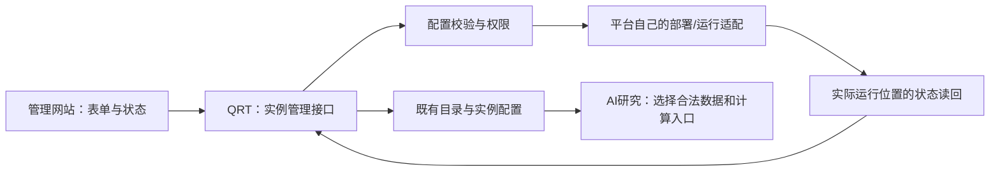

# 运行实例管理与平台解耦方案

2026-09-08，按用户关于“在 Settings 仓库和管理网站加减运行平台”的讨论整理。此文定义后续管理模块；本轮没有新增资源、启用账户或实现下述新接口。

## 目标与对象

允许用户在管理网站增加、配置、停用、移除**已支持平台的运行实例**。同一个 IBKR、LongBridge 等平台可以有多个实例，各实例绑定明确账户、部署与策略。新增券商种类先交付适配器和验证，再进入可选目录。

| 对象 | 例子 | 允许的管理动作与健康含义 |
| --- | --- | --- |
| 交易运行实例 | 某个 IBKR 账户上的策略服务 | 新增配置、校验、启用、停用、退役；检查会话、应到业务周期、订单和对账 |
| 数据源连接 | Alpaca Market Data、批准的 A 股行情来源 | 绑定/解绑、检查访问权限及产物时效；不提供交易启停按钮 |
| 连接服务 | 某个 IBKR Gateway | 关联实例、查看会话和依赖；移除前检查共享依赖，重启仍是单独运维操作 |

同一来源可以服务多个研究任务；一个 Gateway 也可能关联多个服务目标。增加或减少一个实例，不要求新增或删除仓库。

多个实例不等于允许多个服务同时接管同一账户。新增与重新绑定时仍须满足现有账户唯一执行者、订单限制和对账要求；不能通过换实例名称绕过冲突检查。

## 复用当前实现

- `platform-config.json`、生成的 `config.js` 和 `platform_registry.js` 已是支持平台及能力的目录；保留它们，不再建立第二套插件注册中心。
- `/admin` 与 `/api/admin/config` 已有管理员认证、同源写保护、account options、审计和 KV 存储。目前账户配置与访问权限在同一提交中，页面还主要依赖 JSON 编辑。
- `account_options_schema.js` 已描述实例键、名称、目标、账户/部署选择器、服务名和默认策略/执行模式；优先沿用字段和身份，不重造运行目标 ID。
- 已有 runtime lifecycle、execution evidence、decision-data 和风险配置应作为读回来源；配置记录不能代替这些观察结果。

## 模块职责

QRT 负责配置、依赖关联和操作编排；各平台负责实际 API/云资源差异，策略仓只负责策略计算。QRT 不导入券商 SDK，不持仓、不对账、不保存凭据明文。现有 Secret Manager / 受保护环境继续负责凭据；页面仅保存已批准存储的引用并显示“可用/不可用”，不提供绕过账户认证的入口。

## 最小分阶段实现

### 1. 先分离实例配置编辑

在现有 Worker 内提供窄实例接口，例如 `/api/admin/runtime-instances`；命名以实现时接口清单为准。复用现有管理员/同源认证、account options 校验、KV 和审计，不允许该接口修改管理员或登录权限。旧 `/api/admin/config` 保持兼容，迁移后也必须经过同一实例规则，不能留下旧入口绕过新保护。

页面从 JSON 编辑改为表单：选择已支持的平台，填写实例名称、已有部署/账户引用、合法策略、数据/连接依赖。服务名、账户身份或 execution mode 的变化按已有身份变更处理，不能作为普通改名绕过审批。

新增默认处于未应用、未启用状态。返回配置保存结果和实际运行观察两个独立字段；没有部署读回就显示“待应用/未知”。有版本冲突时拒绝过期编辑，不能只靠浏览器上一次读到的列表覆盖他人改动。KV 不提供事务 CAS；需要并发写时，先复用已有串行工作流或使用具备真实事务能力的存储，不能用读后写模拟原子性。

### 2. 再接平台应用与退役

新增：选择适配器 → 保存实例配置 → 校验部署/凭据引用与依赖 → 审阅实际变更 → 明确启用 → 读回。已有资源绑定与新建资源分开；新资源涉及费用或权限时展示具体变更及其授权要求。

停用：调用既有精确目标 stop-only。只有实际触发源与运行开关读回一致才能标记停用；配置保存不算完成。停新触发不代表在途请求已结束。

移除：先确认已停止新触发，再核对在途任务、未决订单和账户接管/持仓关联。条件满足才从可操作实例列表退役；保留旧实例 ID、审计、历史证据及关联，防止复用旧 ID 误接历史订单。默认不删除云资源、凭据、历史资料或自动平仓。共享数据源/Gateway 尚有引用时不能直接移除。

活跃资金目标不能通过删配置让系统“看不见”。证据不足则显示具体未完成条件；已经停用的实例也不能因重新加入目录自动恢复。

### 3. 数据源和 Gateway 沿同一管理页分类呈现

通过既有数据源 ID 和运行引用关联；不同类别共用身份、表单和查看体验，各自调用适用的校验器和操作。Alpaca 当前归入数据来源；额外 `alpaca` 观察标识仍兼容历史 shadow 材料，不能生成实盘实例。QMT 策略示例先关联研究数据与计算入口，有真实 miniQMT 运行环境后才能建立券商实例。

AI 可以建议依赖、配置检查与研究任务；接口的能力和授权由确定性代码判断，不由模型填写 `live=true` 获得权限。

## 验收与改动范围

首批主要文件：`worker.js` 的管理路由/handler/页面、`account_options_schema.js` 及其实际 schema、既有 Worker 测试与管理文档。平台能力增加才改 `platform-config.json` 并重新生成资产；具体部署动作留在被选平台的现有适配器。

需要验证：管理员与跨站限制；未知平台/重复实例/敏感字段拒绝；新实例默认未启用；配置保存不冒充运行；停用/退役保护；旧管理入口不能绕过规则；过期编辑与重复请求；共享依赖阻止误删；旧证据保持可读；数据源不被要求有交易心跳。对实际资金目标的应用验证另按该目标已授权操作执行，不用假订单测试。

此模块可以与研究链共享实例身份和观察来源，但不应成为修复监测及首条 A 股研究示例的前置大重构。
